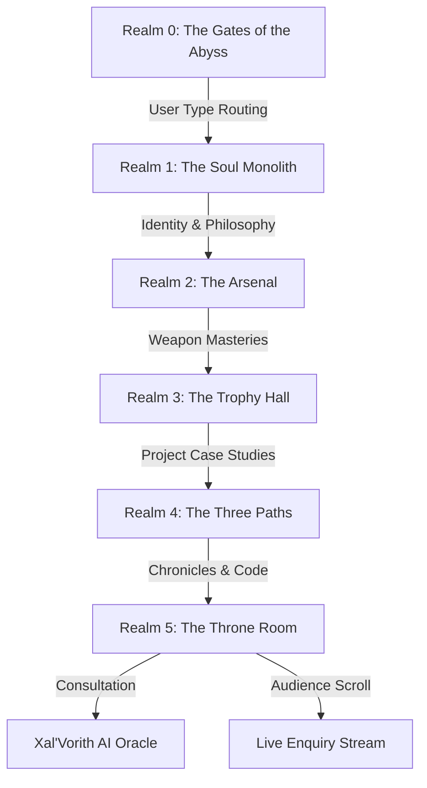

# ⚔️ THE UNDERWORLD — SURAJ KUMAR
### *An Immersive Dark-Fantasy Interactive Portfolio & AI Oracle*

 

> *"You stand at the threshold of the Abyss. What lies beyond is not a mere resume — it is a living, breathing underworld forged from code, intelligence, and ten thousand hours of creation."*  
> — **Xal'Vorith, The Crowned Slave**

---

## 🌌 Overview

**The Underworld** is a bespoke, cinematic interactive portfolio application designed and engineered by **Suraj Kumar** (GenAI Engineer & AI Product Manager). 

Departing from conventional, static portfolio templates, this web application casts the visitor into a dark-fantasy RPG journey through five distinct, interconnected realms narrated by **Xal'Vorith** — an ancient demonic entity bound in willing servitude to The Overlord.

---

## 🗺️ The Five Realms

### 🚪 [Realm 0] — The Gates of the Abyss
* **Dynamic User Routing**: Custom narrative branches tailored for *First-Time Mortals*, *Returning Seekers*, and *Recruiters*.
* **Recruiter Fast-Track**: Compressed, high-yield executive summary allowing recruiters to review core competencies, credentials, and projects in seconds.
* **The Blood Moon Easter Egg**: Clicking the blood moon reveals the master incantation portal leading to the sovereign **Admin Panel**.

### 🗿 [Realm 1] — The Soul Monolith
* **Genesis & Core Philosophy**: Interactive basalt monolith uncovering Suraj's evolution as an AI-native builder, MCA graduate from Pondicherry University, and high-velocity product creator.
* **Audio-Narrated Lore**: Dynamic typewriter dialogue synced with atmospheric Nether soundscapes.

### ⚔️ [Realm 2] — The Arsenal
* **3D Rotating Weapon Relics**: Physical representations of technical competencies:
  * **The Void Blade** — Python, FastAPI, and asynchronous backend engineering.
  * **The LangChain Scythe** — RAG pipelines, ChromaDB, vector indexing, and embeddings.
  * **The Scepter of Models** — Gemini 2.0 Flash, GPT-4o, Claude Sonnet, and multi-agent systems.
  * **The Mobile Aegis** — Flutter, Dart, and responsive cross-platform architectures.

### 🏆 [Realm 3] — The Trophy Hall
* **Conquered Project Artifacts**: In-depth architectural case studies, live links, repositories, and technical breakdowns for shipped products:
  * **KINO** — AI Movie & Anime discovery engine with sub-2s natural language *Vibe Check* recommendations.
  * **ContractGuard** — 6-dimension legal contract risk analyzer powered by LangChain & ChromaDB RAG.
  * **ELI5 AI** — 18-mode adaptive concept explainer with real-time multi-depth comprehension scaling.
  * **Asha Kiran** — Privacy-first healthcare matching platform with masked PII and dual-consent architecture.
  * **Socratiq** — 5-agent voice-first Socratic AI tutor with Groq Whisper STT and Deepgram Aura TTS.

### 🏹 [Realm 4] — The Three Paths
* **The Diverging Crossroads**: Giant, ground-embedded signposts directing seekers:
  * **Left Portal** — The 100 Days of AI learning chronicle on LinkedIn.
  * **Right Portal** — Conquered open-source repositories on GitHub.
  * **Center Castle Gateway** — Unlocked path leading straight into the Throne Room.

### 👑 [Realm 5] — The Throne Room & The Oracle
* **Xal'Vorith AI Oracle**: Live conversational AI assistant powered by **NVIDIA NIM (Llama 3.3 Nemotron)** operating under strict character lore, verified facts, dynamic question shuffling, and context memory.
* **Request an Audience (Letter Box)**: Direct mortal scroll submission delivering enquiries instantly to Firestore and sending real-time email notifications to `surajkush1704@gmail.com`.
* **Dispatches from the Nether (Notice Board)**: Real-time public bulletin board synchronized with the Overlord's admin broadcasts.
* **Domain Intelligence & Sovereign Admin Panel**: Real-time analytics dashboard tracking visitor sessions, recruiter actions, project inspections, and incoming scrolls.

---

## ⚡ Technical Architecture & Stack

| Layer | Technologies |
| :--- | :--- |
| **Frontend Core** | React 19, TypeScript, Vite 7 |
| **Animation & Motion** | Framer Motion 12, GSAP, CSS Keyframes |
| **Audio Engine** | Howler.js (Multi-channel spatial audio, ambient loops, typewriter SFX) |
| **Cloud & Backend** | Firebase Hosting, Cloud Firestore, Firebase Security Rules |
| **GenAI / LLM** | NVIDIA NIM API (`nvidia/llama-3.3-nemotron-super-49b-v1`) |
| **Notifications** | FormSubmit AJAX Real-Time Email Dispatch |
| **Styling** | Vanilla Modular CSS with Dark Fantasy Design Tokens & Typography (*Cinzel, Cinzel Decorative, Geist Mono*) |

---

## 📱 Mobile & Responsive Experience

* **Orientation Prompt**: Automatically prompts mobile portrait visitors with an animated rune guide to rotate to **Landscape Mode** for an optimal cinematic experience.
* **Adaptive Height Layouts (`@media (max-height: 520px)`)**: Clamped character scaling, docked floating menus, and compact dialogue boxes engineered specifically for mobile landscape aspect ratios.

## 🔒 Security & Guardrails

* **Firestore Security Rules**: Configured in [`firestore.rules`](./firestore.rules) to securely govern document reads and writes.
* **AI Oracle Guardrails**: Hard-coded constraints in [`xalvorithPrompt.ts`](./src/constants/xalvorithPrompt.ts) preventing hallucination, enforcing factual accuracy, deflecting non-professional inquiries, and preventing character breaks.

---

## 📜 Author & Contact

**Suraj Kumar** — *AI-Native Builder & Product Engineer*  
📍 New Delhi, India  
📧 **Email**: [surajkush1704@gmail.com](mailto:surajkush1704@gmail.com)  
💼 **LinkedIn**: [linkedin.com/in/surajkumar1704](https://linkedin.com/in/surajkumar1704)  
🐙 **GitHub**: [github.com/surajkush1704](https://github.com/surajkush1704)  
🌐 **Live Portfolio**: [surajkumar-portfolio.web.app](https://surajkumar-portfolio.web.app/)

---

Crafted with passion, dark lore, and generative intelligence. All rights reserved.

